# Final-pjt
## 0. 프로젝트 소개

> **과거를 추억할 수 있는 공간을 만들어보자**

매번 반복되는 일상에 지친 당신에게 휴식처를 제공해드리는 사피 무-비

## 1. 프로젝트 명세

### 개발 환경
- 개발 언어
  - Django
  - Vue

- 목표
  - 영화 데이터 기반 추천 서비스 구성
  - 영화 추천 알고리즘 구성
  - 커뮤니티 서비스 구성
  - HTML, CSS, JavaScript, Vue.js, Django, REST API, Database 등을 활용한
    실제 서비스 설계
  
  

### 개발 일정

- 전체 일정

| 날짜 | 개발 도구 |                             내용                             |
| :--: | :-------: | :----------------------------------------------------------: |
| 5/20 |  django   |                         ~~ERD 설계~~                         |
|      |    vue    |                      ~~페이지 Design~~                       |
| 5/22 |  django   | ~~Movie 전체, 세부 조회 Review 전체, 세부 조회 Review 작성 및 수정, 삭제 기능 구현 Comment 작성 및 수정, 삭제 기능 구현 Account계정 관련 기능 구현~~ |
|      |    vue    |               ~~초기 Vue 설정(Router, Vuex)~~                |
| 5/23 |  django   |              ~~개봉예정작, 현재 상영작 모델링~~              |
|      |    vue    |             ~~Movie 제작~~ ~~Review 제작~~<             |
| 5/24 |  django   |                ~~장르별 추천 알고리즘 구현~~                 |
|      |    vue    | ~~~~개봉예정작, 현재 상영작 front 설계(구현 X)~~  ~~Detail, Review(Read), Like구현~~ ~~불필요 컴포넌츠 제거 (초기 설계 변동)~~ |
| 5/25 |  django   |                 ~~검색 알고리즘 구조 파악~~                  |
|      |    vue    | ~~장르별 추천 페이지 front 설계~~ ~~Review (Delete, Update) 구현~~  ~~Card Glide형식 구현~~ |
| 5/26 |  django   | ~~검색 알고리즘 기반 모델링~~  ~~검색 알고리즘 마무리~~  ~~User Model Serializer 수정~~ |
|      |    vue    |        ~~영화 추천 front 제작~~  ~~CSS 마무리~~         |

- 상세 일정
  - 5/20
    - ERD : 명세서를 기반하여 필수 모델과 저희 팀이 구현하고싶은 페이지를 고민하고 이에 필요한 모델을 설계했습니다.  API 요청을 통한 데이터를 기반으로 필요한 필드를 설정하고 테이블간 관계를 설정했습니다.
    - Page Design :  각 데이터를 페이지의 어느 위치에 배정할지 디자인설계를 진행했습니다.
  - 5/22
    - model에 Movie, Review, Comment를 설계하고 이를 기반으로 Serializer를 작성했습니다.
    - urls.py 및 요청 방식에 따라 CRUD를 실행할 views.py 작성했습니다.
    - 회원가입 및 로그인, 로그아웃 테스트 진행했으며 영화 리스트 전체 조회 및 상세 조회, 리뷰 전체 조회 및 상세 조회 / 리뷰 작성, 수정, 삭제 /  댓글 작성, 수정, 삭제 확인했으며 리뷰 삭제 시 작성되어있던 댓글도 모두 삭제되도록 했습니다.
    - vue는 기본 환경만 세팅한 후 공부하고 진행할 예정입니다.
  - 5/23
    - profile serializer에 구성을 변경했습니다(movie > review)
    - nowplaying, upcoming 테이블을 제작했습니다.
    - serializer를 수정했습니다. (필드 추가)
    - Django와 Vue의 연동을 진행했습니다. 
    - router를 이용한 view들과 navbar를 구현 했습니다.
    - main 화면에서 인기 영화들의 리스트들을 카드 형태로 구현 했습니다.
    - 충돌이 발생해서 gitignore 수정 및 브랜치 생성하여 관리 구조를 변경했습니다.
  - 5/24
    - 영화 리스트들의 상세보기&리뷰 버튼을 구현 했습니다.
    - 영화 Detail 페이지를 구현 했습니다
    - 영화 좋아요 기능, 리뷰 작성 기능을 구현했습니다.
    - Django에서 불필요한 모델을 수정했습니다.
    - 초기 설계한 컴포넌트들 중 필요없는 컴포넌트를 제거 했습니다.
  - 5/25
    - 리뷰 삭제, 수정 기능 구현 했습니다.
    - 유저 프로필 페이지 구현 중 입니다.
    - main 페이지 배치 수정 중입니다.
    - 장르별 페이지, 연도별 페이지를 glide형식으로 구현 했습니다.
    - 각 페이지는 랜덤으로 20개의 영화가 나타나도록 했습니다.
    - 연도별 추천 알고리즘을 구현하고 있습니다.
  - 5/26
    - 페이지 별 CSS를 통해 구조를 다듬었습니다.
    - 연도를 입력받아 해당 연도에 개봉된 영화를 나타내는 알고리즘을 구현했습니다.
    - User모델에 serializer를 수정하여 프로필페이지에 표현할 내용을 추가했습니다.

  

### Team info

|  |  |
| :----------------------------------------------------------: | :----------------------------------------------------------: |
|                            김광용                            |                            이건후                            |
|                  데이터 수집, BE & FE 구현                   |                  데이터 수집, FE & CSS 구현                  |

## 2. Final-pjt-back

- **Structure**

|    앱    | API 요청                                                     |
| :------: | :----------------------------------------------------------- |
|  movies  | 영화 리스트  조회(GET)                                       |
|          | 영화 세부정보  조회(GET) 영화 리뷰 전체 조회(GET) 영화 좋아요(POST) 영화 리뷰 작성(POST) |
|          | 영화 리뷰 수정(PUT)     영화 리뷰 삭제(DELETE)          |
|          | 장르별 영화 랜덤 추천(GET)                                   |
|          | 연도별 영화 랜덤 추천(GET)                                   |
|          | 원하는 연도 영화 랜덤추천(GET)                               |
| accounts | 프로필 유저가  좋아요한 영화(GET)      프로필 유저가 생성한 리뷰(GET)      프로필 유저가 생성한 댓글(GET) |

- **ERD**

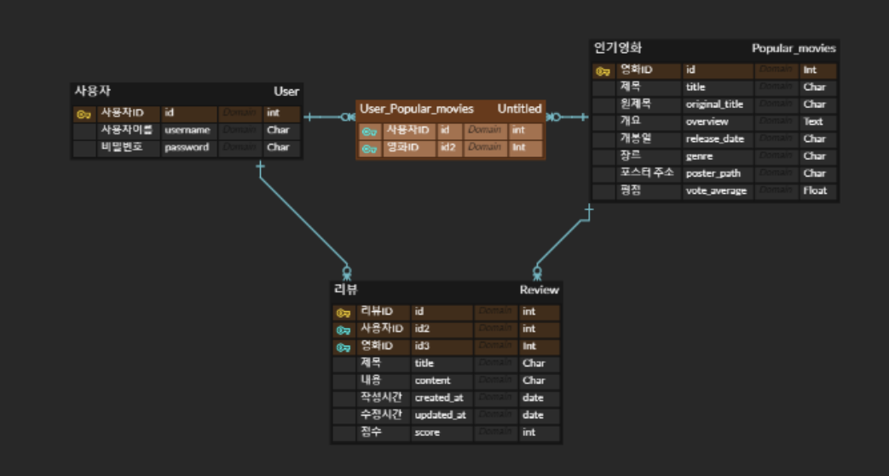

- 추천 알고리즘
  - 사용자가 찾기 원하는 연도에 개봉된 영화 정보를 랜덤으로 가져와 20개를 나열

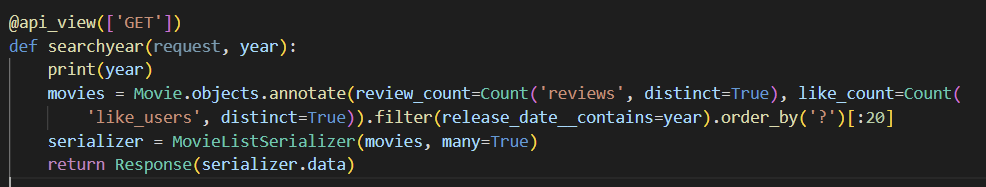

## 3. Final-pjt-front

- **Structure**

|              URL              |    컴포넌트     |                         기능                          |
| :---------------------------: | :-------------: | :---------------------------------------------------: |
|               /               |  MovieListView  |                 전체 영화 리스트 출력                 |
|        movies/:moviePK        | MovieDetailView | 영화 세부내용 조회 리뷰 전체 조회 리뷰 작성 |
|         movies/genre          |    GenreView    |                장르별 영화 데이터 저장                |
|                               |   GenreMovies   |                glide형식으로 영화 표현                |
|                               |    MovieList    |               영화를 카드형식으로 출력                |
|        movies/pastyear        |  PastYearView   |                연도별 영화 데이터 저장                |
|                               |   PastMovies    |                glide형식으로 영화 표현                |
|                               |  PastMovieItem  |               영화를 카드형식으로 출력                |
|       movies/searchyear       | SearchYearView  |                       영화 검색                       |
|   /movies/:moviePk/reviews    |   ReviewForm    |                       리뷰 작성                       |
| /movies/:moviePk/reviews/edit | ReviewEditView  |                       리뷰 수정                       |
|             /404              |   NotFound404   |                    에러페이지 표시                    |
|               X               |     NAVVAR      |                      상단에 위치                      |
|            /login             |    LoginView    |                        로그인                         |
|            /logout            |   LogoutView    |                       로그아웃                        |
|            /signup            |   SignupView    |                       회원가입                        |
|      /profile/:username       |   ProfileView   |                        프로필                         |

- **Design**

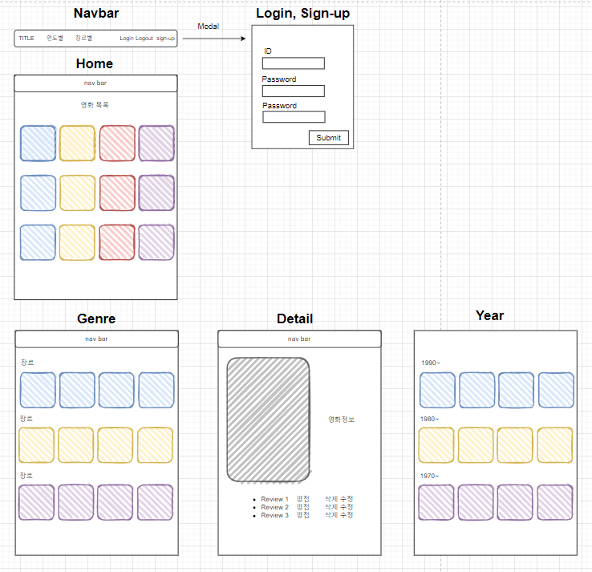

## 주요기능

- 로그인
  - 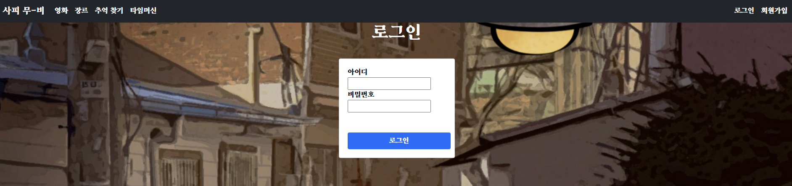
  - 사용자 아이디와 비밀번호를 통해 접속할 수 있습니다.
  - 다른 페이지에서 로그인되어있지 않다면 해당 페이지로 이동합니다.
- 회원가입
  - 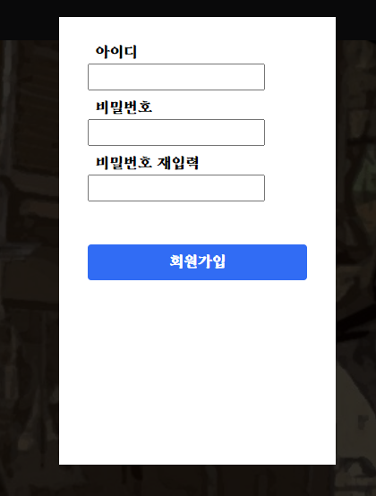
  - 아이디, 비밀번호를 통해 계정을 생성할 수 있습니다.
  - 아이디가 중복되거나 비밀번호 재입력 시 동일하지 않다면 에러 메시지를 출력합니다.
- 프로필
  - 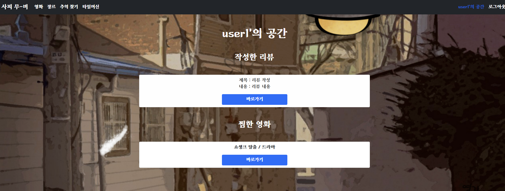
  - 사용자 프로필 화면을 나타냅니다.
  - 사용자가 남긴 리뷰, 좋아요 표시를 한 영화에 대한 정보를 표시합니다.
  - 해당 리뷰 및 영화 페이지로 이동할 수 있습니다.
- 메인페이지
  - 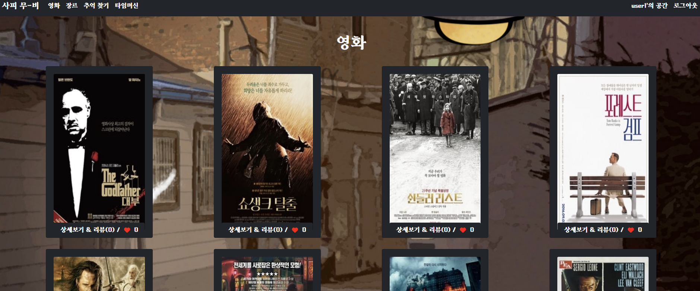
  - 가장 먼저 평점순(TMDB기준)으로 영화를 나열합니다.
  - 각 카드별 상세보기 버튼을 통해 각 페이지의 디테일로 이동할 수 있습니다.
  - 각 영화별 리뷰 및 좋아한 유저의 수를 파악할 수 있습니다.
- 디테일 페이지
  - 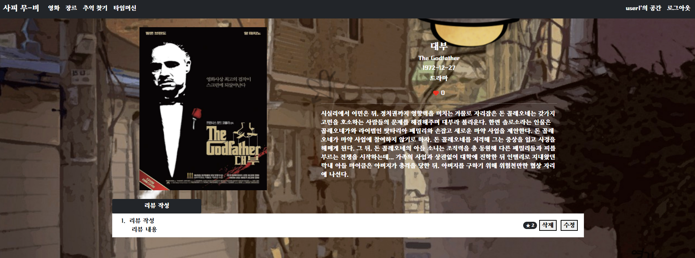
  - 디테일 페이지는 영화의 상세 정보를 표현합니다.
  - 사용자는 영화가 좋다면 좋아요를 남길 수 있습니다.
  - 하단에는 리뷰를 작성할 수 있으며, 작성된 리뷰목록은 디테일 페이지에 표시됩니다.
  - 본인이 작성한 평점은 수정 및 삭제할 수 있습니다.
- 리뷰 작성 & 수정
  - 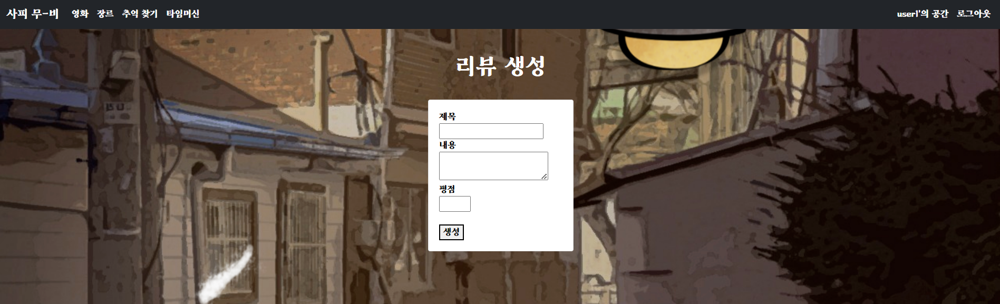
  - 리뷰는 제목, 내용, 평점을 입력하여 생성또는 수정할 수 있습니다.
  - 리뷰의 점수는 1~5점 사이로 남길 수 있습니다.
  - 생성한 리뷰는 해당 영화의 디테일 페이지에 기록됩니다.
- 장르별 추천 페이지
  - 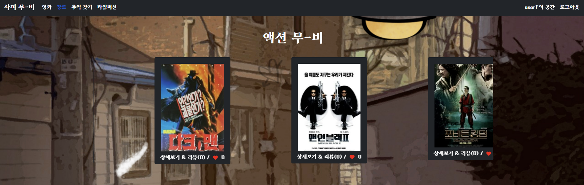
  - 해당 페이지는 장르별로 랜덤한 20개의 영화를 가져와 나열합니다.
  - 20개의 영화는 glide를 통해 슬라이드되며 마지막 영화까지 도달하면 처음 영화로 되돌아옵니다.
  - 해당 페이지에서 상세페이지로 이동할 수 있습니다.

- 추억찾기
  - 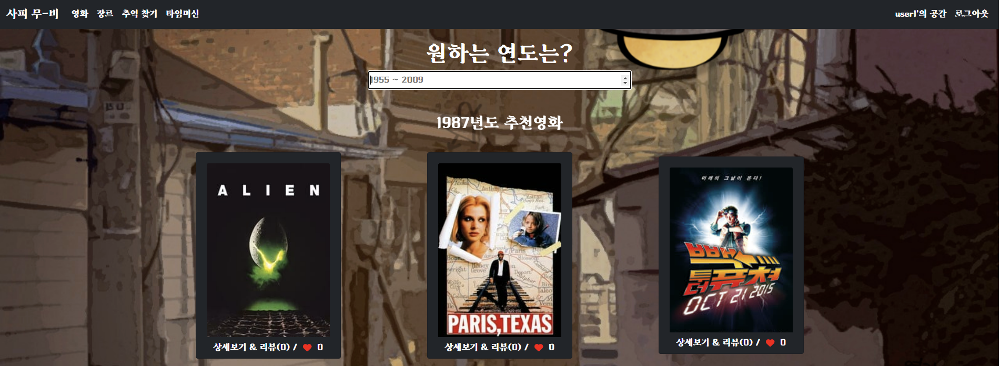
  - 사용자가 원하는 연도로 검색을 받아 해당 연도에 개봉된 영화를 랜덤으로 20개 나열합니다.
  - 사용자는 1955~2009년 사이에 개봉된 영화를 찾을 수 있습니다.
- 타임머신
  - 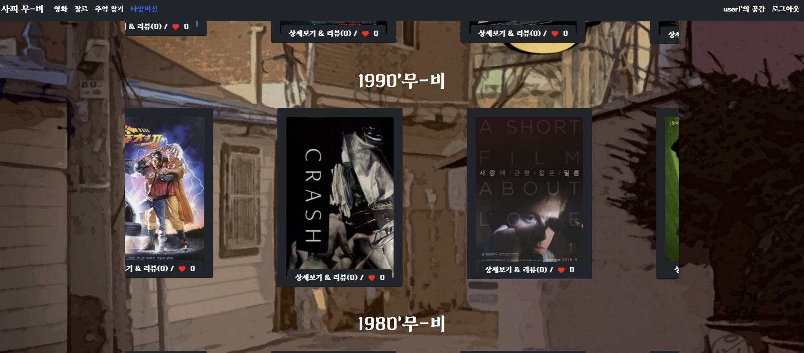
  - 10년단위로 출시된 영화 중 랜덤한 20개를 나열합니다.
  - glide를 활용해 나열되며 사용자는 상세보기를 통해 디테일 페이지로 이동할 수 있습니다. 

## 느낀점

- 김광용

  - 아이디어 - ERD & UI - 모델링 - 프론트 - 마무리 CSS 순으로 모든 과정이 중요하다는걸 느낄 수 있었습니다. 명세상으로는 역할을 나눴지만 페어와 함께하며 서로 안되는 부분은 같이 고민하고 해결해나갔습니다. 페어가 없었으면 기간안에 이정도 구현은 절대 못했다고 생각합니다. 
  - 초반에는 모든 개발과정에 참여해서 빨리 일을 진행하고 싶었습니다. 하지만 그럴수록 깃은 충돌이 발생하고 컴포넌트는 섞여 당황스러웠습니다. 중반부터는 페어를 믿고 제가 할 수 있는 다른 기능을 찾아 구현하면서 속도가 붙었습니다. 단순 대학교 팀플이 아닌 개발자로서의 프로젝트 때 팀원들의 역할분담이 얼마나 중요한지 알 수 있었습니다.
  - 첫 프로젝트로써 매우 만족한 결과라고 생각합니다. 완성도보단 그 과정에 가치를 가졌고 결국 우리의 첫 작품은 완성됐습니다. 앞으로 남은 프로젝트동안 제가 가고싶은 방향에 맞춰 구현능력을 더 키우고 겸사겸사 간단하게 CSS도 배워 다음 프로젝트 때 도움이 되도록 준비하고싶습니다. 

- 이건후

  - 앞서 간단한 프로젝트를 배운 여러 기술과, 지식을 통해 이번 프로젝트를 진행했다. A부터 Z까지 빈 틀에서 시작하는 프로젝트는 처음이라서 처음엔 많이 당황도 했고, 횡설수설 했지만 팀장과 함께 헤쳐나가고, 서로 모르는 부분을 채워가며 나름 성공적으로 진행했다고 생각한다.

    아직 깃을 통한 협업에 능숙하지 않아, conflict를 만나기도 하고, '이게 왜 되는거지?', '이게 왜 안되는거지?' 를 무한히 반복하며 결국엔 해낸 우리 결과물을 보며  뿌듯하기도 했다. 앞으로 있을 프로젝트는 지금보다 힘들겠지만 이러한 경험을 토대로 다음 프로젝트엔 더 나은 결과물을 만들고, 배포까지 해볼 수 있는 경험이 있으면 좋겠다.
